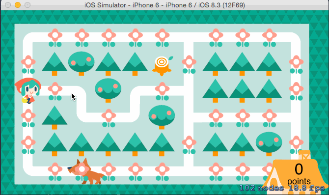

#SpriteKit の利用

書籍： Sprite Kit iPhone 2Dゲームプログラミング 7 章 のゲームをリファクタリングした。  
See  http://www.shuwasystem.co.jp/support/7980html/4055.html

## 操作：
ゲームオーバー画面でタップすると、ゲームを再開します。  

## 改良点
- player が一本道を進んでいて、道が曲がったときは、止まらずに道なりに進むようにした。
- csv 読み込み処理を関数として独立させた。
- tileMap() を 2 次元配列にした。

## TODO
- CSV ファイル内容をもっと直感的にマップ作成できるようにする。
